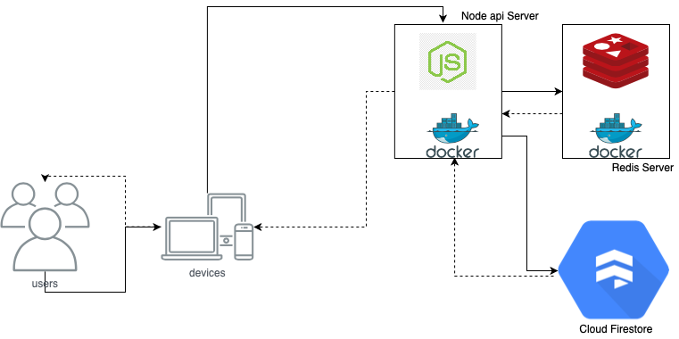

# car-park-api

```
docker-compose up
GOTO: http://localhost:5000

To test directly on cloud please use the below url
http://159.65.10.139/  instead of local docker instance

```

# List of endpoinst

```
http://localhost:5000/register - POST [Registration]
http://localhost:5000/login -POST [Login]
http://localhost:5000/getFreeSlots - GET [show available slots]
http://localhost:5000/userInfo - GET [Get username of loggedin user]
http://localhost:5000/parkCar - POST [To park car]
http://localhost:5000/unparkCar/:slotId - GET [TO unpark Car]
http://localhost:5000/getCarByNo?plateNo=wxx 5678 - GET [Retuns the car detals if avaialble]
http://localhost:5000/getCarsByType?type=seadn - GET [Search by carType]

# Additional endpoints
http://localhost:5000/slots - GET [Retuns total parking slots]
http://localhost:5000/updateSlots - POST [Set total parking slots]
```

[SampleResponse](./EndpoinResponses.md)

```
1. Database Use: Firbase
2. Used Redis for caching totalSlots and available slots endpoints
3. Did Basic Validation where ever reqired
4. End-to-end flow video is recorded please it from below link
5. created a kubemanifests.yaml to run the whole setup in kubernetes - haven`t tested it completely. let me know if needed i can run and record that too
```

# [[Api Demo Video Link]](https://drive.google.com/file/d/1d0b9ACZsKQ8UIqHXITwP_1Ngxdnrl43K/view?usp=sharing)

# [[ Front End Video Demo]](https://drive.google.com/file/d/1oaELRVrBGYC5ad3cIYH2OZOYSrnLy6v5/view?usp=sharing)

#### Note: i have`nt Done much on the front end only completed the registration login and show 'Available Slots' 'Total Slots' and logout.

# TestCase

```
yarn test
```

[[Postman Collection Url]](https://drive.google.com/file/d/1RY7FGpgtBU5FDG3FCZTCleKl3aHhXWn1/view?usp=sharing)


